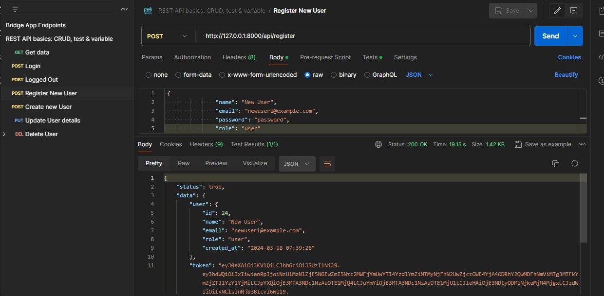
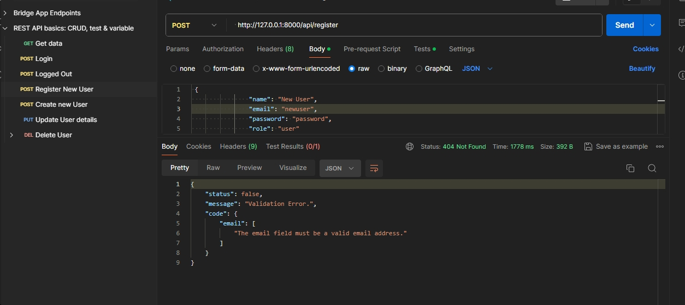
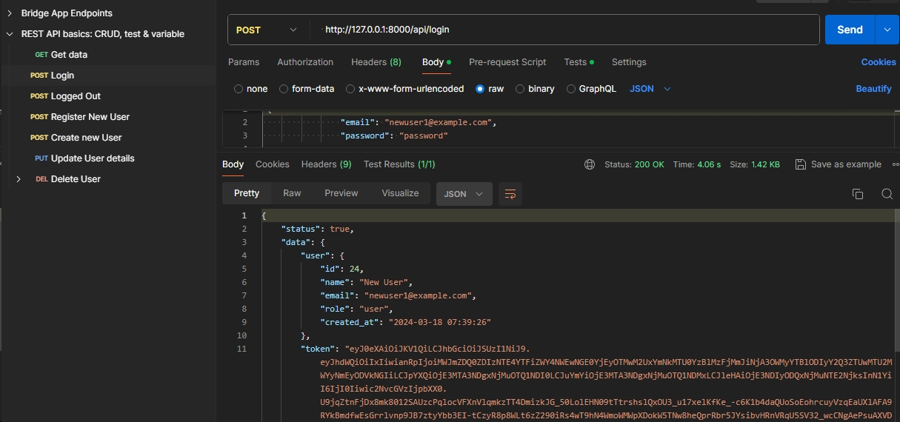
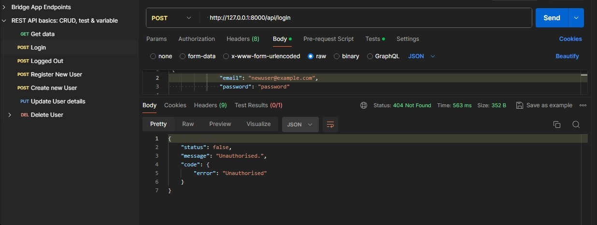
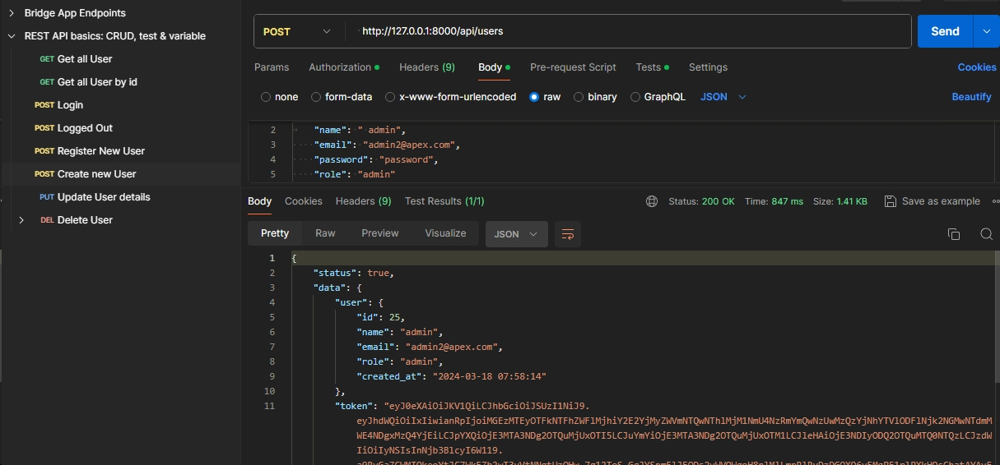
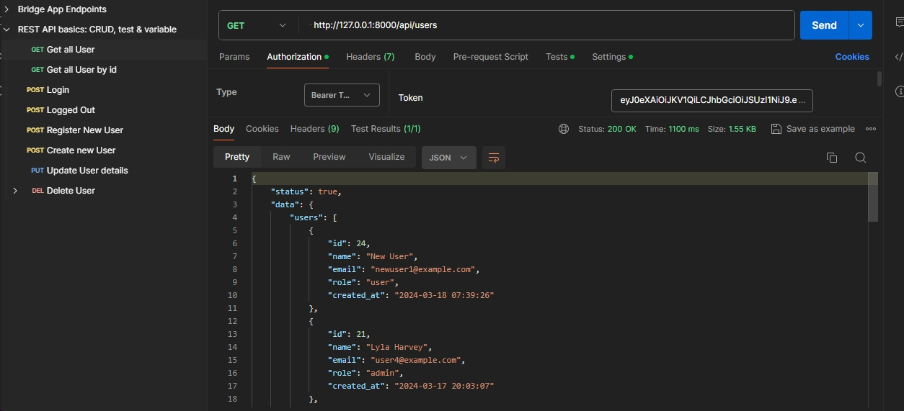
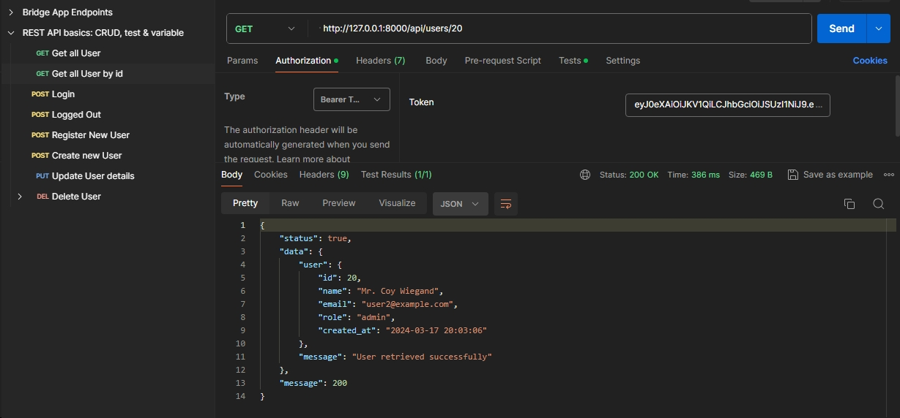
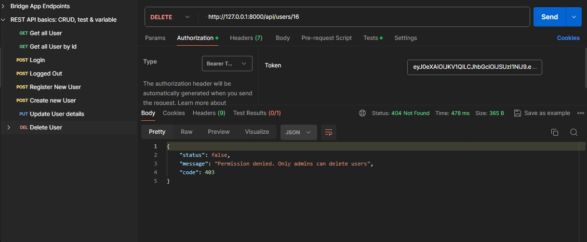
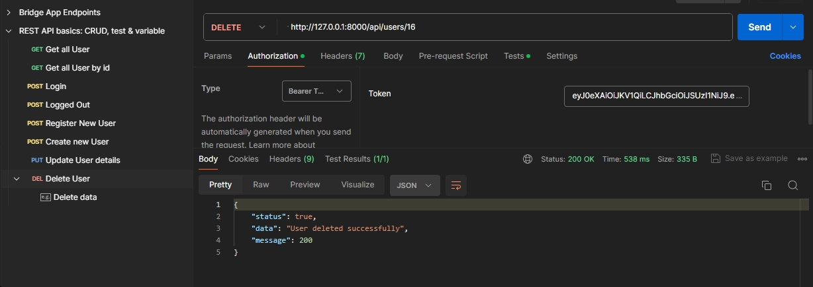

## Task - User Management System API

### **Task Overview**

Develop a **User Management System API** using Laravel. This API will be responsible for handling user profiles within an application, including operations such as creating, updating, viewing, and deleting users.

- [composer install - To install necessary packages]().
- [php artisan migrate]().
- [php artisan passport:install- to install the tables for the tokens]().
- [php artisan serve- to start the serve]().

seeding is not necessarily as you can start with the registration

## Route
- POST            api/login
- POST            api/logout  
- POST            api/register   
- GET|HEAD        api/users
- POST            api/users
- GET|HEAD        api/users/{user}
- PUT|PATCH       api/users/{user}
- DELETE          api/users/{user}

## Test Example from Postman
### Test for Registration with valid data

### Test for Registration with invalid data

### Test for login with valid data

### Test for login with invalid data

### Test for Create New user with valid data

### Test for Update user with valid data

### Test for get all User

### Test for get user by id

### Test for  user delete user

### Test for  Admin delete user

## Test Case

- php artisan test --filter AuthenticationTest
- php artisan test --filter CrudTest

##

